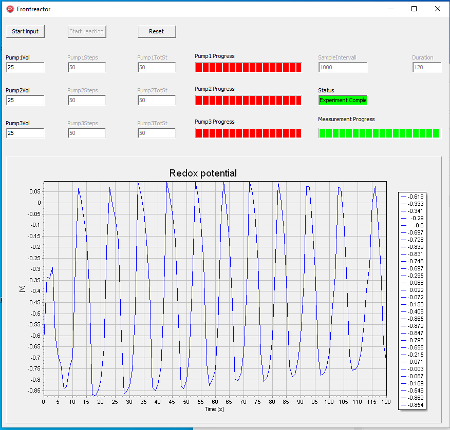

# CGE2 Reactor Project
This repository contains the code for the chemical reactor project of the CGE2 course. It was written using cpp builder and uses the Nidaq library for communicaton with instruments. 
It provides a Simple GUI for controlling pumps supplying the reagents for a Briggs-Rauscher reaction as well as acquiring and plotting the data from an electrode. It implements multi threading...
# Overview
- Start input rinses the reactor and sets it up for the experiment
- Run reaction will pump the reagents then measure and rinse once completed
- Reset will reset the experiment to repeat it

